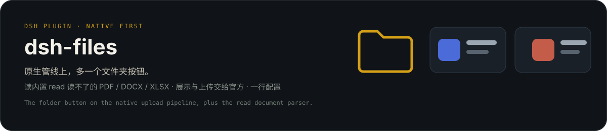

<p align="center">
  
</p>

# dsh-files

一个包，一行 cordis 配置。Web UI 多一个回形针，模型多一个读文档的工具。

<p align="center">
  
</p>

DeepSeek Harness 双面插件（dual-face plugin）。两项能力：

- **上传**：输入框工具栏回形针按钮，文件以浮动彩色卡片呈现，发送时自动把路径附入消息；按会话隔离存储到 `<会话工作区>/.dsh-filess/<sessionId>/`，TTL 定期清扫，sha256 内容去重
- **文档读取**：`read_document` 工具读取文本 / PDF / DOCX / XLSX，内容嗅探判定真实格式（不信任扩展名），大小预检，LRU 解析缓存

## 功能

### 上传

- 会话隔离存储：文件落在发起会话自己的工作区 `.dsh-filess/<sessionId>/` 下，agent 的 fs 后端一定能读到；会话之间互不可见
- 两种入口：输入框工具栏回形针按钮选择，或直接把文件拖到页面任意位置（拖拽悬停有遮罩提示）；多文件横排
- 浮动彩色卡片：按**字节嗅探的真实格式**着色（PDF 红 / DOC 蓝 / XLS 绿 / TXT 灰），伪装文件（exe 改 .pdf）不按扩展名显示；文件名、大小、移除按钮
- 发送联动：卡片挂载后文件路径自动注入输入框，随消息发出
- 安全护栏：loopback 或 `trustedHosts` 白名单 host + same-origin + sec-fetch-site 三重校验（与官方 `--trusted-host` 栅栏同语义：Origin 只比较 host 部分，兼容上游终结 TLS 的反向代理/隧道部署）；文件名消毒（控制字符、路径分隔、点段、前导点全部剥离，并按 UTF-8 字节截断，长中文名不触发 ENAMETOOLONG）；未知会话 403；并发限流（默认 4）超限 429
- 生命周期管理：TTL 清扫（默认 7 天），空会话目录自动回收；可选会话存储配额（`maxUploadBytesPerSession`，超限 507）

### 文档读取

- 内容嗅探：PDF 头 / ZIP 中央目录成员 / UTF-8 / UTF-16 BOM / GB18030，全部从字节判定，扩展名伪装（可执行文件、图片改成 .pdf）一律拒绝；上传侧同步嗅探，卡片显示真实格式
- 编码链：UTF-16 BOM → UTF-8（fatal）→ GB18030（fatal），中文 GBK 文件可直接读取
- 分页读取：行号 + offset/limit 分页，长文档按需翻页；窗口总字符预算（`maxOutputChars`）超限时截断并显式标记剩余行数
- 行号策略按格式分化：text（代码/配置）带行号供精确定位；PDF/DOCX/XLSX 段落流不带行号（省 token）
- XLSX sheet 级读取：`sheet` 参数指定工作表时返回该 sheet 全量（不受行截断限制），其余 sheet 走合并读取（默认前 5 个），截断显式标记；`list_sheets` 参数先列出全部 sheet 名（不读单元格），越界报错附带可用 sheet 列表
- 扫描件明示：无文本层的 PDF（扫描件/纯图片）返回显式提示而非空串，模型不会误判为空文件
- 解析缓存：LRU 双约束（条目数 + 字节预算），键为 `(targetKey, fileVersion, format, sheet, listSheets)`，文件改动自动失效
- 大小预检：`stat` 先查，超限直接报 `FS_TOO_LARGE`，不读字节
- 协作取消：解析期间监听执行信号，用户取消/会话关闭立即中止
- 输出呈现：工具结果通过 `presentationMeta` 投影为 `card: 'read'`，Web UI 复用官方读文件卡片（行号/高亮/滚动），模型侧只收紧凑行文本

## 安全

- 解析依赖全部为无已知漏洞的维护中库：`pdfjs-dist`（Mozilla 官方）、`mammoth`、`read-excel-file`（纯只读）
- ZIP 中央目录探测不展开任何成员，成员数与成员名长度均有上限，恶意归档安全拒绝
- 文件读取走 `ctx.fs`，继承会话沙箱与 fs 观察策略，与内置 read 工具同权
- 上传内容不做格式白名单强制（默认全允许），由会话沙箱兜底

## 安装

```sh
dsh plugin --profile web add dsh-files
# 重启 dsh web
```

## 配置

```yaml
- id: upload-toolkit
  name: 'dsh-files'
  config:
    maxFileBytes: 25165824        # 单次文档读取字节上限
    readLimit: 800                # 单次返回行数上限（默认 800，翻页成本低）
    sheetRowLimit: 200            # 每个 sheet 保留行数
    maxSheets: 5                  # 每个工作簿读取的 sheet 数
    cacheEntries: 16              # 解析缓存条目数
    cacheMaxBytes: 67108864       # 解析缓存字节预算
    maxOutputChars: 50000         # 单次输出窗口总字符预算（超限截断并标记）
    uploadMaxBytes: 25165824      # 单次上传字节上限
    allowedExtensions: []         # 上传扩展名白名单（空 = 全部允许）
    uploadTtlMs: 604800000        # 上传文件保留时长（7 天）
    sweepIntervalMs: 3600000      # 清扫间隔
    maxConcurrentUploads: 4       # 并发上传数
    maxUploadBytesPerSession: 0   # 每会话存储配额（0 = 不限）
    uploadDir: /abs/path          # 无 sessions 服务时的回退上传根目录
    trustedHosts: []              # 上传栅栏接受的额外 host（与 dsh web --trusted-host 对齐）
```

`trustedHosts` 用于反向隧道 / 内网穿透 / 局域网部署：GUI 以公网或内网域名访问时，浏览器 `Host` 头携带该域名，默认 loopback-only 栅栏会 403。条目为裸 `host`（匹配任意端口）或 `host:port`（精确匹配），与官方 `/api` 信任栅栏语义一致；非规范写法（路径、userinfo、零填充端口等）在启动时报错。示例：

```yaml
    trustedHosts:
      - dsh.example.com
```

## 开发

```sh
pnpm install
pnpm test          # node --test 单元测试（57 项）
pnpm build         # esbuild 打包客户端 bundle
npx tsc --noEmit   # 类型检查
```

## 许可

MIT
