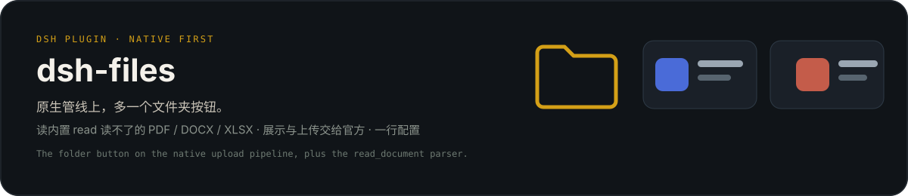
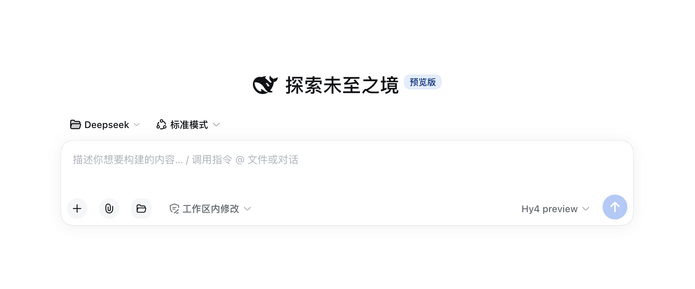
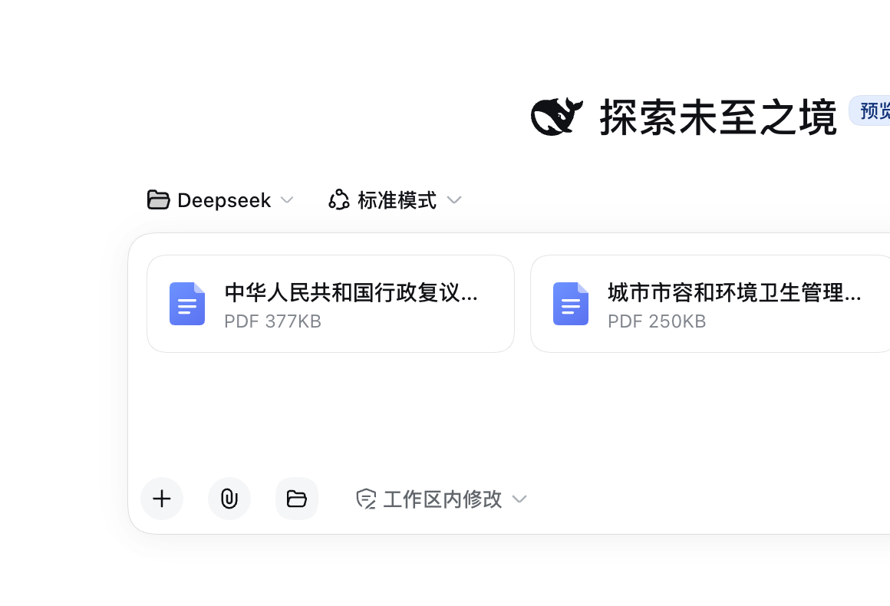

<div align="center">

[English](README.md) | [简体中文](README.zh.md)

</div>

<p align="center">
  
</p>

# dsh-files

## In one line

Let the AI actually read the documents you upload — and let your files come back out.

## The two annoyances it removes

You have probably hit both:

- You hand the AI a **contract PDF** or a **spreadsheet**, and it says "I can't read this file." The file is fine — the built-in read tool **only accepts plain text** and refuses binary content outright.
- You want the AI to look at **that attachment you uploaded days ago**, but the attachment store is write-only: you cannot browse it, and you cannot pull the file back onto your machine.

dsh-files fills exactly those two holes. **Read**: the AI gets the text out of PDF / Word / Excel. **Fetch back**: you and the AI both see what is in the store, and you can pull a file back out.

## What changed in this release

- **SDK aligned with the host at 0.2.0-rc.2**: fixes "the plugin button is missing and native upload is dead in the desktop App" — the plugin used to be built against the old SDK, colliding with the host's newer bundled components in the client module graph
- **Errors now speak plainly**: a failure used to hand you a cold error code; now it tells you **what to change next**. Reach the server over your LAN and the attachment routes answer 403 — the response prints the exact `trustedHosts` line to add, ready to copy
- **LAN / domain deployments are documented now**: that section used to be blank, leaving you to guess
- **The division of work with the host is written down**: what the host already does (upload, images, document preview) versus what remains unique to this plugin — so the wheel is not reinvented

---

Here is a file's **four-stage session lifecycle**, one official gap filled per stage:

- **Ingest**: the **folder button next to the native paperclip** (plus a same-named entry in the official "+" command menu) — the browser flattens the directory (Office lock files, `.DS_Store`, `.env` and other system/hidden files are filtered), and every file enters the official native attachment pipeline
- **Read**: the **`read_document` tool** — structured text extraction for binary documents (PDF / DOC / DOCX / XLSX) plus enhanced text reading (encoding fallback, paging, sheet-level access)
- **Manage**: the **`attachment_list` / `export_attachment` tools** — make the attachment store visible to the model (name/size/sha) and copy a file into the workspace for read/edit/bash to work on
- **Fetch back**: the **attachment dock** (one official pill below the composer card) plus download/export routes and an `@` attachment source — the store becomes visible to users and files can be pulled into the browser (the right path for remote/LAN deployments); the `@` menu inserts the official handle line, identical to what the model saw at upload

> Upload, images and `@` reference were removed in 0.5.0 — harness 0.1.3 ships them natively (universal file upload, the image vision pipeline, unified `@file`/`@session` reference), and does it better. This plugin is part of the [taxueseek plugin matrix](https://github.com/taxueseek#deepseek-harness-%E6%8F%92%E4%BB%B6); the flagship is [argo](https://github.com/taxueseek/argo).

## Why it exists

Native upload in harness 0.1.3 stores files as byte objects and hands the model one handle line (name, size, digest, read-only path) to read with **file tools** — but the built-in read tool rejects binary content with `FS_NOT_TEXT`. Structured text extraction for PDF / DOC / DOCX / XLSX, plus attachment-store listing and export (the official GC is on the roadmap and the store is invisible to the model today), are the gaps the official stack leaves open; this plugin fills them.

<p align="center">
  
</p>

## Capabilities

- **Content sniffing**: PDF header / OLE Compound File (Word 97-2003) / ZIP central-directory members / UTF-8 (fatal) / UTF-16 BOM / GB18030 — decided from bytes, never from extensions; disguised files (an exe renamed .pdf) are rejected. The format hint is only a last resort when bytes are fully unknown
- **Legacy .doc**: macOS uses the system `textutil` (most complete body and date lines in the gold-standard comparison), other platforms fall back to pure-JS `word-extractor`
- **Encoding chain**: UTF-16 BOM → UTF-8 (fatal, NUL rejected) → GB18030 (fatal) → UTF-16 without BOM (high-confidence guard); GBK Chinese and BOM-less UTF-16 both read
- **Paged reads**: line numbers + offset/limit; the per-call character budget differs by format (text full, xlsx 3/4, pdf/doc/docx 1/2), overflow truncates with an explicit remaining-lines marker
- **Line-number policy**: text (code/config) carries line numbers for precise edits; PDF/DOC/DOCX/XLSX are paragraph flows without line numbers (saves tokens)
- **XLSX sheet-level reads**: `list_sheets` names the sheets, the `sheet` parameter reads one sheet in full (no row cap), out-of-range errors list the available sheets

<p align="center">
  
</p>
- **Scanned PDFs are explicit**: a PDF with no text layer returns an explicit notice, not an empty string
- **Cooperative cancellation**: parsing listens on the execution signal; user cancel / session close aborts immediately
- **Output projection**: text results project onto the official `card: 'read'` file card; reads go through `ctx.fs` and inherit session sandbox and fs-observation policy
- **Attachment-store window**: `attachment_list` enumerates the store (original name / sha prefix / size / mtime); `export_attachment` copies by sha prefix or exact name with `COPYFILE_EXCL` no-overwrite, dest validated through the `ctx.fs` sandbox
- **Attachment library (0.5.3)**: one **official Pill** in the host's `conversation.composer.dock` slot (where the host itself renders session-stats pills) reading `附件库 N · X MB`; clicking expands the card below it: the library list (name/size/short time), **re-insert** (mount a stored file back onto the composer as a fresh official attachment — an old session's upload rides any new session without re-picking from disk), **download** (pull the file to the browser — the right path for remote/LAN use), **export to workspace** (auto-named, collision-safe under `attachments/`) and name search (filtered client-side — no server round-trip per keystroke; the list refetches on re-expand only after 30s). It follows the composer column width; UI data only, zero prompt tokens
- **`@` attachment source (0.5.2)**: the `@` menu gains an attachment group alongside the host's workspace candidates; picking one inserts the official handle line, so the model sees the same file line it saw at upload
- **Download/export routes (0.5.2)**: bytes flow through the official `AttachmentStore.readFileStream` (integrity-checked), behind two gates — Host trust fence (loopback or `trustedHosts`) and a `sha256:` reference whitelist; oversized answers 413

## Install

Requires harness ≥ 0.1.3-alpha.1.

```sh
curl -fsSL https://raw.githubusercontent.com/taxueseek/dsh-files/main/install.sh | sh
# restart dsh web
```

Manual equivalent:

```sh
dsh plugin --profile web add git+https://github.com/taxueseek/dsh-files.git
# restart dsh web
```

> The npm package named `dsh-files` is an unrelated third-party placeholder — install only via the script or the git command above.

## Compatibility

| dsh-files | Harness | Notes |
| --- | --- | --- |
| 0.5.6 | **0.2.0-rc.2 (current, measured)** | Same SDK alignment as 0.5.5; `package.json` now carries machine-readable metadata: `repository`, `engines` (Node ≥ 20), and `dsh.compatibility` (`dshReleases` / `dshOperations`). |
| 0.5.5 | 0.2.0-rc.2 (measured) | SDK aligned with the host `0.2.0-rc.2` (`dsh-fs` / `dsh-tools` / `dsh-client-ui-primitives` all at the host version), so client components resolve without a version ambiguity. |
| 0.5.3–0.5.4 | 0.1.7-alpha.1 | SDK pinned at `0.1.7-alpha.1`; on a `0.2.0-rc.2` host the client icons may fail to resolve (see below). |
| 0.5.x | ≥ 0.1.3-alpha.1 | Older SDK pins (`0.1.0-rc.x`); attachment dock and `@` source predate the host's `conversation.composer.dock` slot. |
| 0.6.x | — | Never released (folded into 0.5.2/0.5.3); do not use. |

Requires Node.js ≥ 20 (the floor the plugin is developed and tested on; the harness CLI itself runs on the user's Node).

The machine-readable compatibility record in `package.json` (`dsh.compatibility`) declares `0.2.0-rc.2` as compatible, with `install` / `start` operations verified as passed on a real host profile (2026-09-29, host `0.2.0-rc.2`); `uninstall` / `rollback` are declared `unknown` because they have not been exercised on this release.

The plugin targets the `alpha` line the maintainer runs locally (`0.1.7-alpha.1`); npm `latest` (`0.1.5-rc.3` at the time of writing) is older, so prefer the git install above over any registry version.

What was actually checked on 0.2.0-rc.2 (2026-09-29, `web` profile) and what it means:

- **Surfaces still resolve**: `conversation.input.left`, `conversation.composer.dock`, the `@` source, the `commandUi` menu contribution and every `dsh-client-ui-primitives` icon used here exist in the official browser roster.
- **Attachment-store layout is unchanged** (`files/<sha2>/<sha>/<name>`); the library scan reads the real store, and the `AttachmentStore.readFileStream` / `llm.fileRequestText` seams are unchanged.
- **The host plugin contract only grew**: `dsh-tools` 0.2.0 adds optional members (`ToolDefinition.projectContent?`, `PreToolDecision.ask.displayReason?`); nothing the plugin relies on was removed.
- **One counter-example worth remembering**: `@deepseek-ai/dsh-client-runtime` is a *row*, not a seed module. Declaring it in `dsh.client.inject` requires the host roster to carry that row; the official 0.2.0 roster dropped it, so a client half that declares it fails to load and takes the whole web boot with it. dsh-files does not declare it and is unaffected.

## Configuration

```yaml
- id: files-toolkit
  name: 'dsh-files'
  config:
    maxFileBytes: 25165824        # byte cap for one document read
    readLimit: 2000               # lines returned per call (paging is cheap)
    sheetRowLimit: 200            # rows kept per worksheet
    maxSheets: 5                  # sheets read per workbook
    maxOutputChars: 24000         # per-call window character budget (truncated with a marker)
    readTimeoutMs: 120000         # per-call timeout (raise for huge PDFs)
    # attachmentsDir: /path/to/attachments/v1  # attachment store root; empty = DSH_HOME / ~/.dsh autodetect
    attachmentsEnabled: true      # master switch for the attachment loop (dock/download/export/@ source)
    maxDownloadBytes: 209715200   # per-download/export byte cap (answers 413)
    trustedHosts: []              # non-loopback host[:port] authorities; required for LAN/domain (same semantics as --trusted-host)
```

## Remote / LAN deployment

The attachment routes are fenced on the `Host` header (same semantics as the host's `--trusted-host`). **A loopback deployment needs no configuration** — opening `http://127.0.0.1:3080` in a browser just works. The moment you reach the server through a LAN address, an internal hostname, or a reverse proxy, the `Host` is no longer loopback and every attachment route answers 403. **That is the fence working, not a fault.**

The only step to make it work is to put the authority from your browser's address bar into `trustedHosts` verbatim:

```yaml
- id: files-toolkit
  name: 'dsh-files'
  config:
    trustedHosts:
      - '192.168.1.20:3080'   # host:port matches that exact port
      - 'dsh.example.com'     # a bare host matches any port on that host
```

You do not have to guess: **the 403 body prints the rejected authority verbatim in its `hint`, ready to copy.** The shape is:

```json
{
  "error": "host-not-trusted",
  "hint": "Browser host \"dsh.example.com:8443\" is not loopback and not in trustedHosts. … trustedHosts: [\"dsh.example.com:8443\"].",
  "docs": "https://github.com/taxueseek/dsh-files#configuration",
  "detail": { "host": "dsh.example.com:8443", "trustedHosts": ["dsh.example.com:3080"] }
}
```

`detail.trustedHosts` is the current allow-list, which is how you spot the most common cause of a 403 in one glance: the deployment moved ports (`:3080` → `:8443`). A bare-hostname entry absorbs that; an exact `host:port` entry does not.

The panel and the `@` attachment source surface the same `hint` (the `@` source also logs one line with the HTTP status), so the interface itself tells you what to change — no log digging.

### Failure response contract

Every failure from `/plugins/dsh-files/attachments*` has the same shape: a machine-readable `error` code, an actionable `hint`, a `docs` anchor, and (when there are live numbers) a `detail` payload.

| `error` | HTTP | Meaning and next step |
| --- | --- | --- |
| `host-not-trusted` | 403 | Host is neither loopback nor in `trustedHosts`; the `hint` carries the authority to allow |
| `invalid-ref` | 400 | `ref` must be `sha256:<64 hex>`, taken from the list route's `ref` field |
| `missing-parameters` | 400 | Export needs both `session` and `ref` |
| `method-not-allowed` | 405 | Export is a POST route; returns the `Allow: POST` header too |
| `session-without-workspace` | 400 | That session has no workspace directory to export into |
| `attachment-not-found` | 404 | No such content reference in the library; list it first |
| `attachment-object-missing` | 404 | The index lists it but the object is gone; re-upload |
| `attachment-corrupt` | 409 | Bytes failed the integrity check; re-upload the source rather than retrying |
| `attachment-too-large` | 413 | Reports real size, cap and `maxDownloadBytes`; the other transfer path may still work |
| `list-failed` / `export-failed` / `attachment-read-failed` | 500 | Carries the underlying reason and what to check |

## Security

### Permission statement

Declared explicitly, mapped to the capability vocabulary automated reviews scan for:

- **Files**: yes. Document parsing is read-only; the attachment-library scan is a host-side read-only walk over the DSH attachment store; export writes only through `ctx.fs`, inheriting the session sandbox. No deletions, no paths outside the store and session workspace.
- **Network**: same-origin only. The client half calls the plugin's own routes under `/plugins/dsh-files/*` served by the host process. No third-party endpoints, no telemetry.
- **Commands**: one, macOS-only — legacy `.doc` files are converted with `textutil` via `execFile`, fixed binary, fixed argument shape, output to stdout. No shell interpolation, no user-supplied binaries.
- **Credentials**: none. The only environment variable read is `DSH_HOME` (a directory path used to locate the attachment store, mirroring the official home-path resolution) — no secrets, tokens, or keychains.
- **External services**: none. Everything runs in the host process and its browser view.
- **Native or executable artifacts**: none in the package. The git tree's `install.sh` is a plain POSIX-sh convenience wrapper (its `curl | sh` one-liner is the documented install path); the published npm `files` set contains JS and docs only.

### Details

- Parsing dependencies are read-only and maintained: `pdfjs-dist` (Mozilla), `mammoth`, `read-excel-file`, `word-extractor` (.doc fallback)
- ZIP central-directory probing never expands members; malicious archives are rejected safely
- Reads and export destinations go through `ctx.fs`, inheriting the session sandbox, same rights as the built-in read tool; the attachment-store scan is a host-side read-only walk with internally-constructed paths
- Attachment download/export flows through the official `AttachmentStore.readFileStream` (integrity check, no absolute paths), on top of the Host trust fence + `sha256:` reference whitelist + size cap; there is no delete route (content-addressed objects may be referenced by historical messages; deletion stays with the official future retention)
- The dock and `@` source are UI-layer data: no systemPrompt injection, no model tools, zero tokens

## Development

```sh
pnpm install
pnpm test
pnpm build
npx tsc --noEmit
```

## License

MIT
